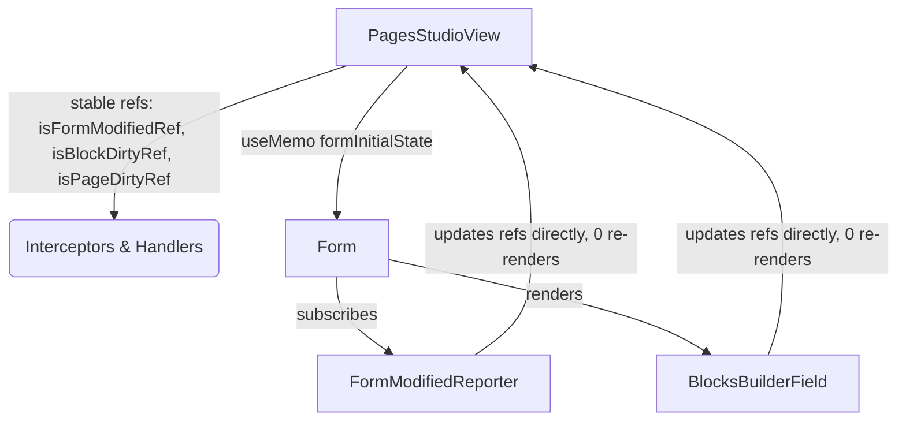

# Spec: Refactoring Unsaved Changes to Prevent Form Reset

**Date:** 2026-05-28  
**Status:** Proposed  
**Author:** Antigravity (Elite Frontend Engineer)  

---

## 1. Problem Statement

After implementing reactive `useField` subscriptions, modifying or reordering blocks causes the custom Pages Studio form to completely reset, discarding any changes or additions the user makes.

### Root Cause Analysis
1. **Unnecessary Parent Re-renders**:
   When a user modifies a field (like typing a title/slug or reordering blocks), `FormModifiedReporter` is reactively re-rendered via `useField` subscriptions. It evaluates that the form is modified and calls `onChange(true)`.
   In the previous design, `onChange` updated the React state `isFormModified` in `PagesStudioView.tsx`, causing a parent component re-render.
2. **Form State Resets on `initialState` Reference Changes**:
   When `PagesStudioView` re-renders, it evaluates:
   ```typescript
   initialState={transformDataToFormState(currentPageData)}
   ```
   Since `transformDataToFormState` returns a brand-new object reference on every invocation, the `<Form>` component receives a new `initialState` object. Payload's `<Form>` component reacts to a changed `initialState` by completely resetting its internal state back to the initial database values, thus discarding the user's unsaved block modifications or additions.

---

## 2. Proposed Design (Refactored Approach)

We will eliminate parent re-renders during active editing by moving the page-level and block-level dirty states into **React Refs** (`useRef`). We will also **memoize** the `initialState` of the Form component using `useMemo` as an extra layer of defense.



### Key Elements of the Solution

1. **Ref-Based Dirty Tracking**:
   Instead of React state, we will maintain stable React Refs in `PagesStudioView.tsx`:
   ```typescript
   const isFormModifiedRef = useRef(false);
   const isBlockDirtyRef = useRef(false);
   const isPageDirtyRef = useRef(false);
   ```

2. **Stable Callbacks**:
   We will define stable callback handlers using `useCallback` to update these refs without triggering any React state changes or parent component re-renders:
   ```typescript
   const handleFormModifiedChange = useCallback((modified: boolean) => {
     isFormModifiedRef.current = modified;
     isPageDirtyRef.current = isFormModifiedRef.current || isBlockDirtyRef.current;
   }, []);

   const handleBlockDirtyChange = useCallback((dirty: boolean) => {
     isBlockDirtyRef.current = dirty;
     isPageDirtyRef.current = isFormModifiedRef.current || isBlockDirtyRef.current;
   }, []);
   ```

3. **Ref-Aware Interceptors**:
   We will register the `beforeunload` and capturing `click` event listeners **exactly once** on component mount. Inside their event handlers, we will dynamically check the current values of `isPageDirtyRef.current`:
   - If `isPageDirtyRef.current` is `false`, they instantly return.
   - If `true`, they block the reload or navigation as expected.
   - Setting state like `pendingNavigationUrl` will only happen when a navigation click is intercepted, showing the modal precisely when needed.

4. **Memoized Form `initialState`**:
   We will memoize `initialState` to guarantee that the `<Form>` component never receives a new object reference unless `currentPageData` actually changes (i.e. on page switch or successful save):
   ```typescript
   const formInitialState = useMemo(() => {
     return transformDataToFormState(currentPageData);
   }, [currentPageData]);
   ```

---

## 3. Detailed Proposed Changes

### A. [MODIFY] [PagesStudioView.tsx](file:///Users/aryannayak/Documents/Portfolio/chambers-of-jeetbhatt/src/components/payload/PagesStudioView.tsx)
- Memoize `formInitialState` using `useMemo` with `currentPageData` dependency.
- Pass `formInitialState` as the `initialState` prop to `<Form>`.
- Replace `isFormModified` and `isBlockDirty` states with `isFormModifiedRef`, `isBlockDirtyRef`, and `isPageDirtyRef` refs.
- Declare stable `handleFormModifiedChange` and `handleBlockDirtyChange` callbacks.
- Register event listeners in `beforeunload` and click interceptor `useEffect` blocks exactly once (empty dependency arrays `[]`), reading dynamically from `isPageDirtyRef.current`.
- Update click and dropdown handlers to read from `isPageDirtyRef.current` instead of `isPageDirty` state.
- Update `onSuccess` to reset `isBlockDirtyRef.current` and update `isPageDirtyRef.current`.

---

## 4. Verification Plan

### Automated/Compilation Checks
- Run `npm run build` or `npx tsc --noEmit` to verify type safety.

### Manual Verification Flow
1. Open Custom Pages Studio.
2. Verify that blocks can be successfully added, deleted, reordered, and edited. Confirm that none of these actions trigger immediate page resets or reversions.
3. Edit a block and verify that attempting to navigate away or close the tab triggers the Unsaved Changes confirmation modal.
4. Reorder/modify blocks on the canvas, save the block, and verify that navigating away triggers the confirmation modal.
5. Click "Discard & Leave" to verify it works, or "Save & Leave" to verify it successfully saves and leaves.
